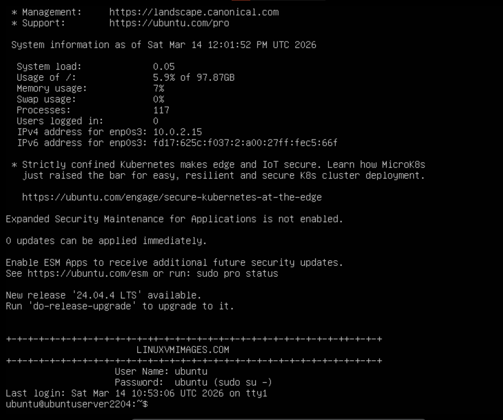
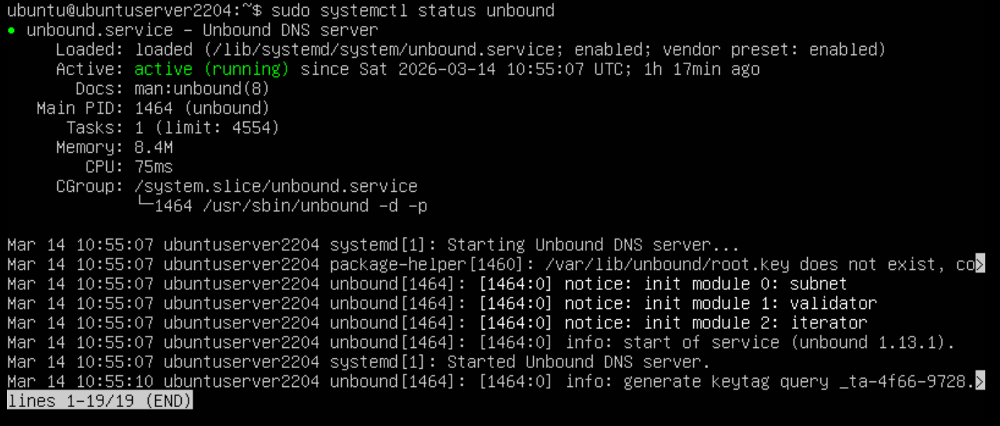
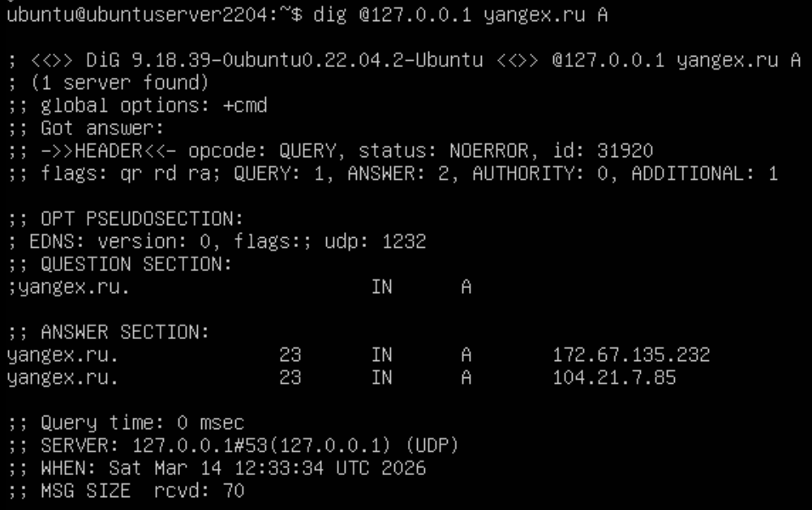

# 0. Подготовка среды

## Установка **Ubuntu server 22.04** в Virtual Box.

 - 2 ядра
 - 4 ГБ RAM
 - Проверяем сетевой адаптер NAT
 - После установки выполняем `sudo apt update && sudo apt upgrade -y`

> [Ссылка на страницу с образом](https://www.linuxvmimages.com/images/ubuntuserver-2204/)

<div align="center">
  
</div>

## Установка Unbound и утилит

```bash
sudo apt install -y unbound unbound-host dnsutils redis-server
```

 - `unbound` - наш DNS-резолвер
 - `unbound-host` - упрощённая утилита для DNS-запросов
 - `dnsutils` - пакет с утилитой `dig` (основной инструмент, которым будем пользоваться для диагностики)
 - `redis-server` - внешний кэш

> Подробнее про каждую можно почитать [тут](UTILS.md)

После установки проверим, что Undound запустился

```bash
sudo systemctl status unbound
```

<div align="center">
  
</div>


## Небольшая настройка

Настройка нужна из-за того, что большинство VM не поддерживают IPv6. Выполняем команду:

```bash
echo -e 'server:\n    do-ip6: no' | sudo tee /etc/unbound/unbound.conf.d/disable-ipv6.conf
sudo unbound-control reload
```

## Проверка работоспособности

```bash
dig @127.0.0.1 yandex.ru A
```

<div align="center">
  
</div>
