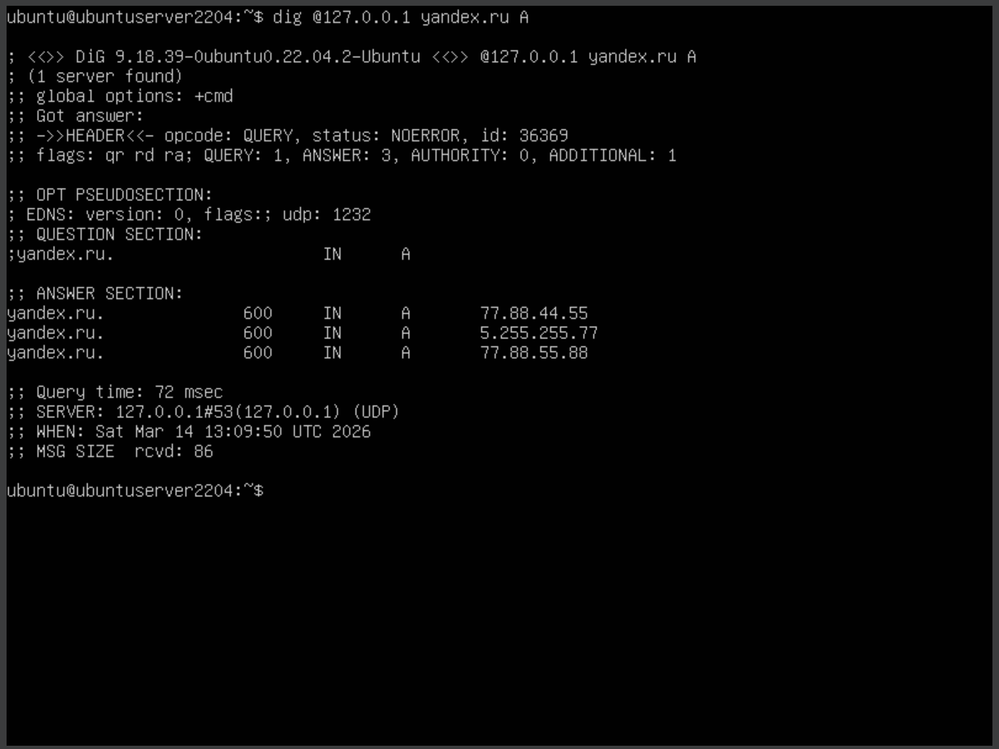
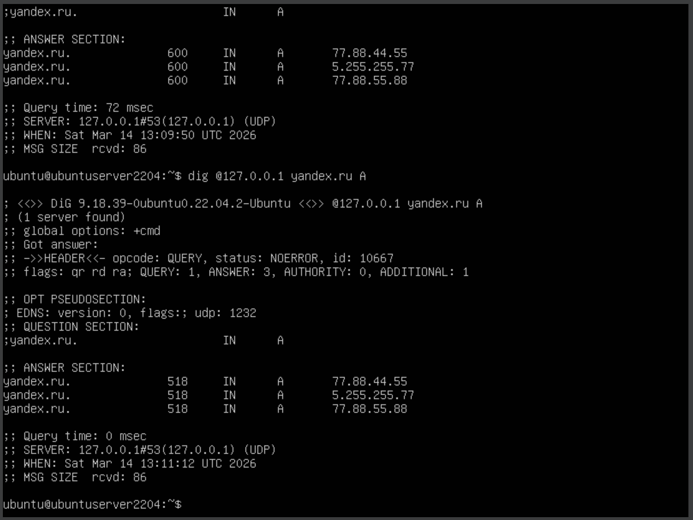
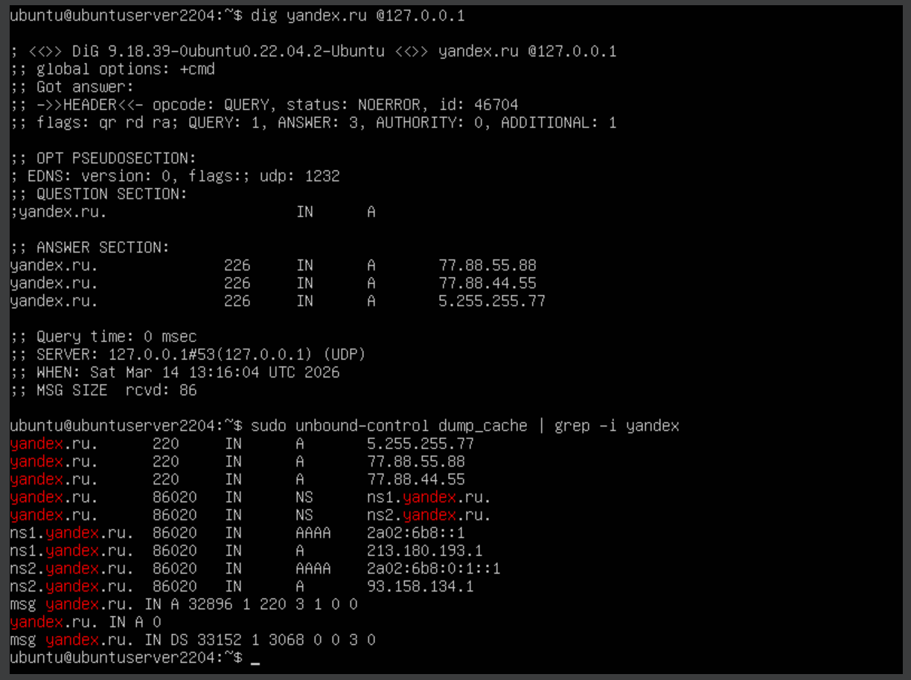
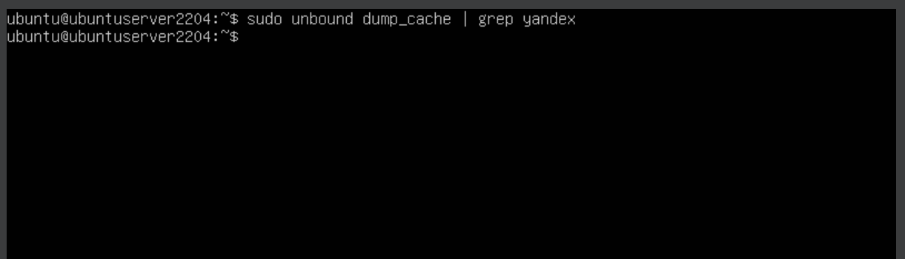
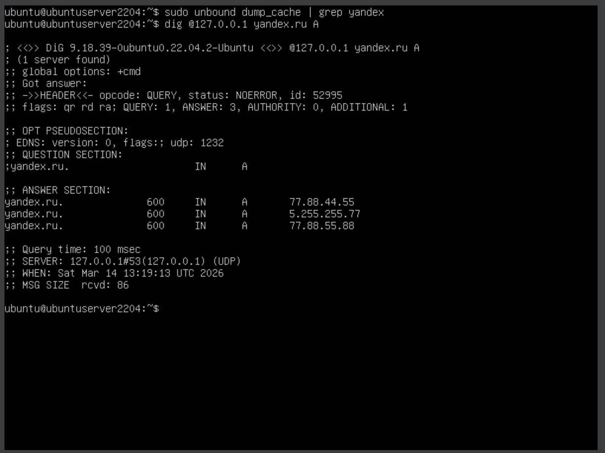

# 1.1A. Кэширование ответа Yandex.ru (адресная запись) — проверка истечения времени кэширования

Задача: показать, что Unbound кэширует A-запись `yandex.ru`, и что после истечения TTL запись пропадает из кэша.

## Шаг 1. Первый запрос — добавление в кэш

Выполним запрос к нашему резолверу:

```bash
dig @127.0.0.1 yandex.ru A
```

В выводе смотрим на поле `TTL` в секции `ANSWER` — это время, на которое Unbound закэшировал запись.

<div align="center">
  
</div>

## Шаг 2. Второй запрос — подтверждение кэширования

Через несколько секунд повторяем тот же запрос:

```bash
dig @127.0.0.1 yandex.ru A
```

Значение TTL должно уменьшиться — это означает, что ответ пришёл из кэша, а не от авторитетного сервера.

<div align="center">
  
</div>

## Шаг 3. Просмотр состояния кэша через unbound-control

```bash
sudo unbound-control dump_cache | grep yandex
```

Видим запись с оставшимся TTL.

<div align="center">
  
</div>

## Шаг 4. Ожидание истечения TTL

Ждём 600 секунд — время жизни записи в кэше:

```bash
sleep 600
```

После истечения TTL проверяем, что запись пропала из кэша сама:

```bash
sudo unbound-control dump_cache | grep yandex
```

Вывод пустой — Unbound автоматически удалил запись по истечении TTL.

<div align="center">
  
</div>

## Шаг 5. Запрос после истечения TTL

```bash
dig @127.0.0.1 yandex.ru A
```

Теперь Unbound снова выполняет рекурсивный запрос к авторитетному серверу — TTL в ответе исходный (не уменьшенный), в данном случае 600 секунд.

<div align="center">
  
</div>