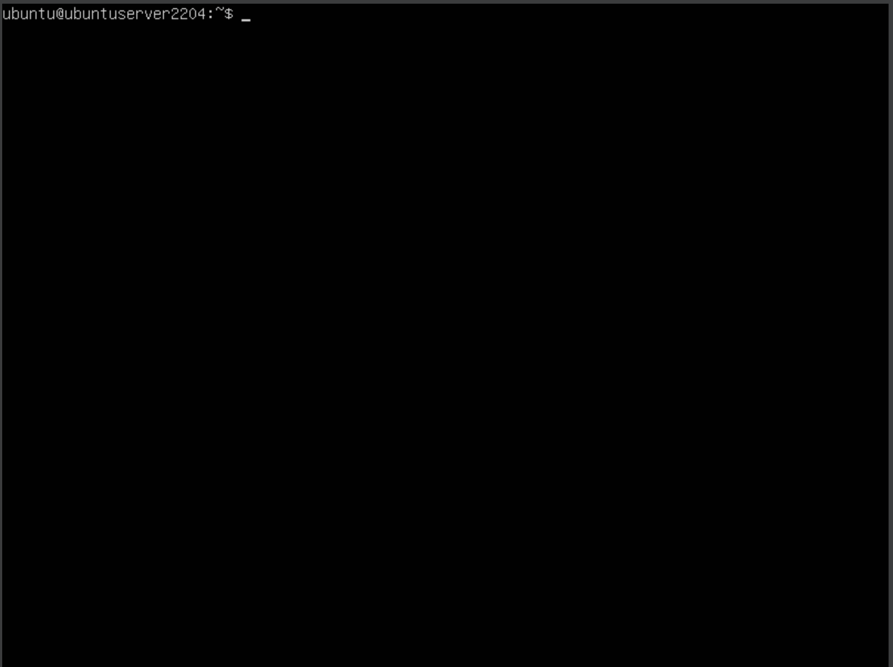
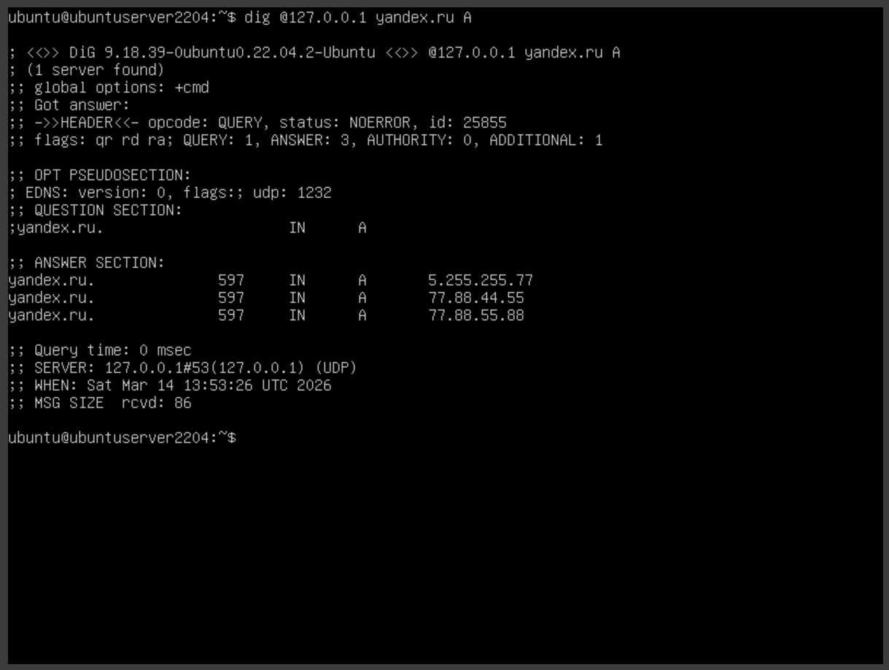
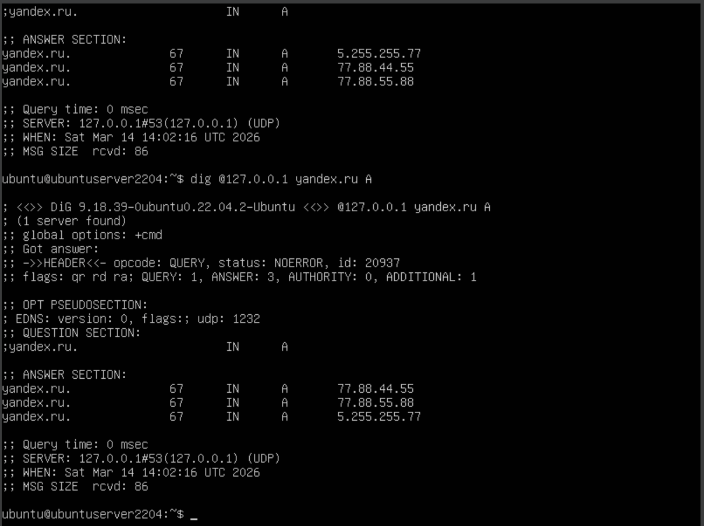
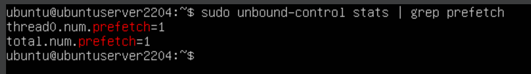

# 1.1Б. Prefetching — принудительное обновление кэша

Задача: включить функцию prefetch в Unbound и показать, что записи обновляются до истечения TTL.

**Prefetch** — механизм, при котором Unbound автоматически обновляет запись в кэше, если к ней поступает запрос, а оставшийся TTL составляет менее 10% от исходного. Таким образом, запись никогда не «устаревает» при активном использовании.

> **Важно:** порог 10% жёстко зашит в исходный код Unbound — изменить его через конфигурационный файл нельзя. `prefetch: yes` только включает/выключает механизм. Чтобы задать другой порог, потребуется пересборка Unbound из исходников с изменённым кодом.

## Шаг 1. Включение prefetch в конфигурации Unbound

Открываем конфигурационный файл:

```bash
sudo nano /etc/unbound/unbound.conf
```

В секцию `server:` добавляем:

```
prefetch: yes
```

Сохраняем и перезапускаем Unbound:

```bash
sudo systemctl restart unbound
```

<div align="center">
  
</div>

## Шаг 2. Первый запрос — добавление записи в кэш

```bash
dig @127.0.0.1 yandex.ru A
```

Запоминаем значение TTL в секции `ANSWER`.

<div align="center">
  
</div>

## Шаг 3. Ожидание — TTL близок к истечению

Ждём, пока TTL опустится до ~10% от исходного значения, затем выполняем повторный запрос:

```bash
dig @127.0.0.1 yandex.ru A
```

При активном prefetch Unbound в фоне отправит запрос на авторитетный сервер и обновит запись. В ответе мы получим старую запись (из кэша), но TTL уже будет обновлён.

<div align="center">
  
</div>

## Шаг 4. Проверка статистики prefetch

```bash
sudo unbound-control stats | grep prefetch
```

В выводе ищем `num.prefetch` — ненулевое значение подтверждает, что механизм сработал.

<div align="center">
  
</div>
