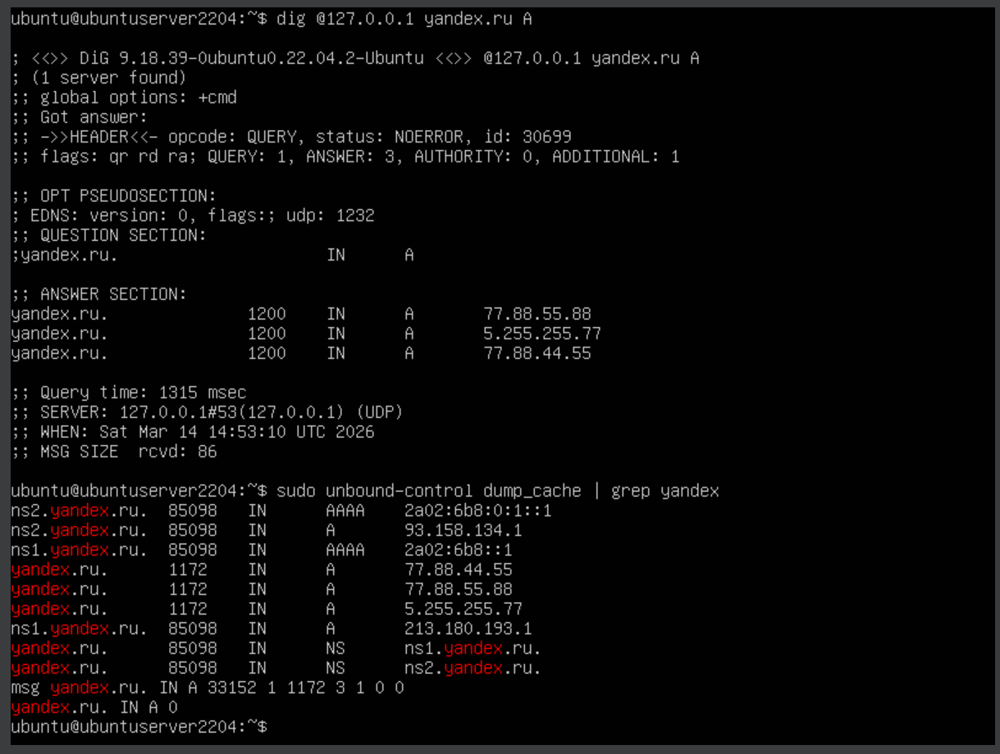
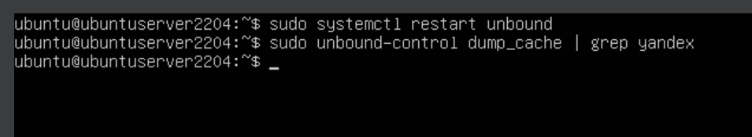

# 1.1Г. Ограничения стандартной сборки Unbound

Задача: обнаружить, что принудительно установленный TTL не защищает кэш от очистки — стандартная сборка Unbound хранит кэш только в оперативной памяти.

## Теория

В задаче 1.1В мы установили `cache-min-ttl: 1200`. Это означает, что запись должна жить в кэше не менее 20 минут. Однако у стандартного Unbound есть фундаментальное ограничение:

**Кэш хранится только в оперативной памяти (in-memory).** При любом перезапуске сервиса весь кэш безвозвратно теряется — вне зависимости от заданного TTL.

Это означает, что `cache-min-ttl` управляет только тем, сколько запись *должна* прожить, но не гарантирует её сохранность при сбоях или перезапусках. Для постоянного хранения DNS-ответов нужен внешний персистентный кэш — например, Redis (задача 1.2).

**Принудительная очистка кэша** — это удаление записей из кэша до истечения их TTL. В стандартной сборке Unbound её могут вызвать:

| Причина | Описание |
|---|---|
| Перезапуск сервиса | `systemctl restart unbound` — кэш в памяти уничтожается полностью |
| Сбой / падение процесса | OOM-killer, аппаратный сбой, сигнал SIGKILL |
| Ручная команда | `unbound-control flush <имя>` или `unbound-control flush_all` |
| Нехватка памяти | Unbound вытесняет старые записи при заполнении `msg-cache-size` |

Во всех этих случаях `cache-min-ttl` не помогает — он задаёт минимальное время жизни записи, но не защищает её от уничтожения вместе с процессом.

## Шаг 1. Убедиться, что запись есть в кэше

Делаем запрос и проверяем кэш:

```bash
dig @127.0.0.1 yandex.ru A
sudo unbound-control dump_cache | grep yandex
```

Запись присутствует, TTL > 600 (подтверждает работу `cache-min-ttl` из задачи 1.1В).

<div align="center">
  
</div>

## Шаг 2. Перезапуск Unbound и проверка кэша после перезапуска

```bash
sudo systemctl restart unbound
sudo unbound-control dump_cache | grep yandex
```

<div align="center">
  
</div>


Вывод пустой — кэш очищен, несмотря на то что TTL ещё не истёк.

## Шаг 3. Подтверждение через повторный запрос

```bash
dig @127.0.0.1 yandex.ru A
```

`Query time` теперь **не равен 0 мс** — Unbound снова обращается к авторитетному серверу, кэш пуст.

<div align="center">
  
</div>
