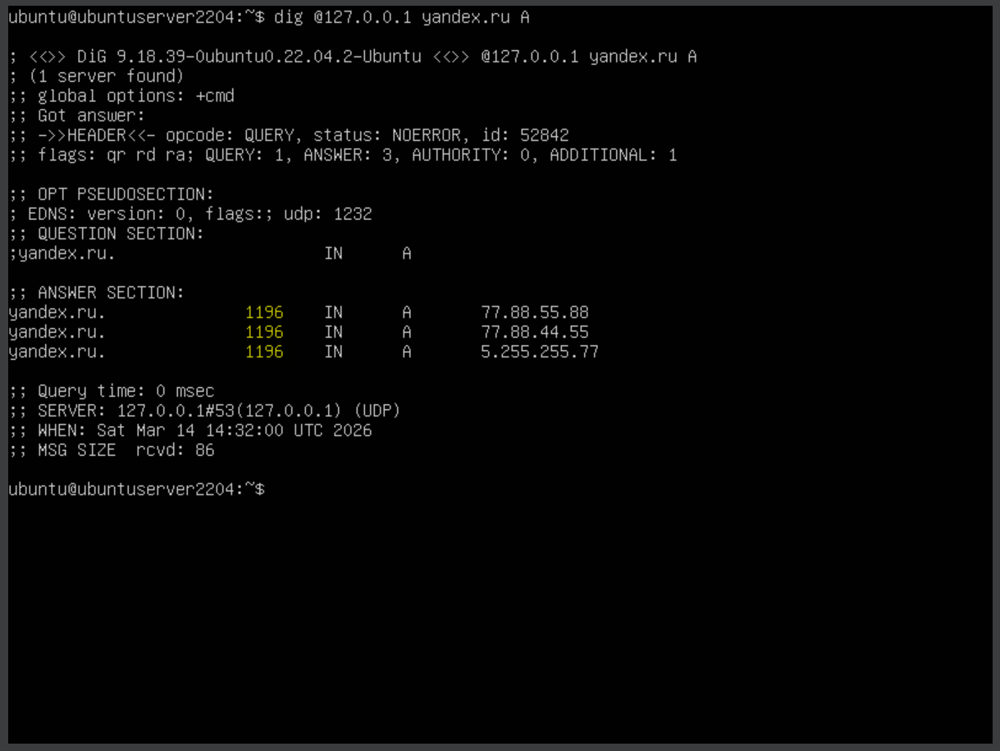
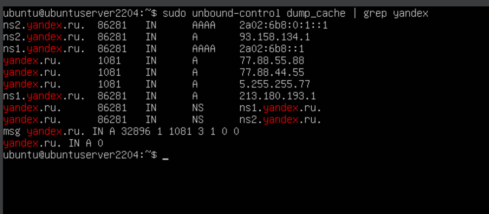

# 1.1В. Принудительное время кэширования стандартными средствами Unbound

Задача: установить минимальное и максимальное время хранения записей в кэше Unbound и убедиться, что TTL из ответа авторитетного сервера игнорируется в пользу заданных значений.

## Теория

Unbound предоставляет два параметра для управления временем кэширования:

| Параметр | Описание |
|---|---|
| `cache-min-ttl` | Минимальный TTL (сек). Если авторитетный сервер вернул TTL меньше этого значения — Unbound использует `cache-min-ttl` |
| `cache-max-ttl` | Максимальный TTL (сек). Если авторитетный сервер вернул TTL больше этого значения — Unbound использует `cache-max-ttl` |

Таким образом, администратор может задать «коридор» допустимых TTL. Это стандартные средства Unbound — изменение кода или пересборки не требуется.

> **Ограничение:** данные параметры работают только в момент добавления записи в кэш. Они не позволяют хранить запись *вечно* — максимальное значение `cache-max-ttl` ограничено возможностями стандартной сборки. Это ограничение будет рассмотрено в задаче 1.1Г.

## Шаг 1. Настройка cache-min-ttl и cache-max-ttl

Открываем конфигурационный файл:

```bash
sudo nano /etc/unbound/unbound.conf
```

В секцию `server:` добавляем:

```
    cache-min-ttl: 1200
    cache-max-ttl: 86400
```

Проверяем синтаксис и перезапускаем:

```bash
sudo unbound-checkconf
sudo systemctl restart unbound
```

<div align="center">
  
</div>

## Шаг 2. Запрос к домену с заведомо малым TTL

Проверим реальный TTL у авторитетного сервера Яндекса (возвращает TTL ≈ 600):

```bash
dig yandex.ru A +norecurse @ns1.yandex.ru
```

Затем делаем запрос к нашему резолверу:

```bash
dig @127.0.0.1 yandex.ru A
```

Если TTL в ответе равен `cache-min-ttl` (1200), а не оригинальному значению (600) — механизм работает.

<div align="center">
  
</div>

## Шаг 3. Проверка через dump_cache

```bash
sudo unbound-control dump_cache | grep yandex
```

В выводе будут видны A-записи `yandex.ru.` с TTL. Если запрос сделан сразу после кэширования — TTL будет близок к 1200; если прошло некоторое время — будет меньше, но всё равно **больше 600** (оригинального TTL). Это доказывает, что `cache-min-ttl` сработал.

Пример вывода (прошло ~119 сек с момента кэширования):

```
yandex.ru.    1081    IN    A    77.88.55.88
yandex.ru.    1081    IN    A    77.88.44.55
yandex.ru.    1081    IN    A    5.255.255.77
```

Строка `msg yandex.ru. IN A ... 1081 ...` показывает оставшийся TTL самого сообщения в кэше.

<div align="center">
  
</div>