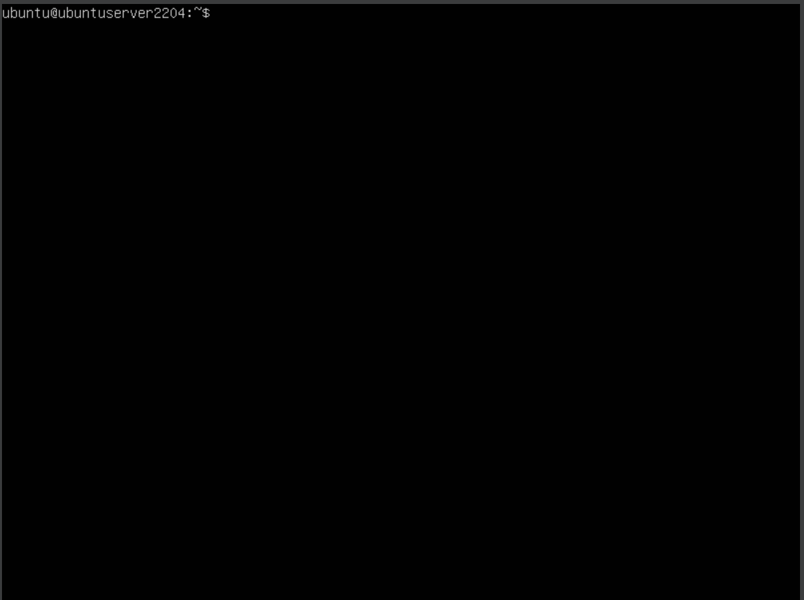
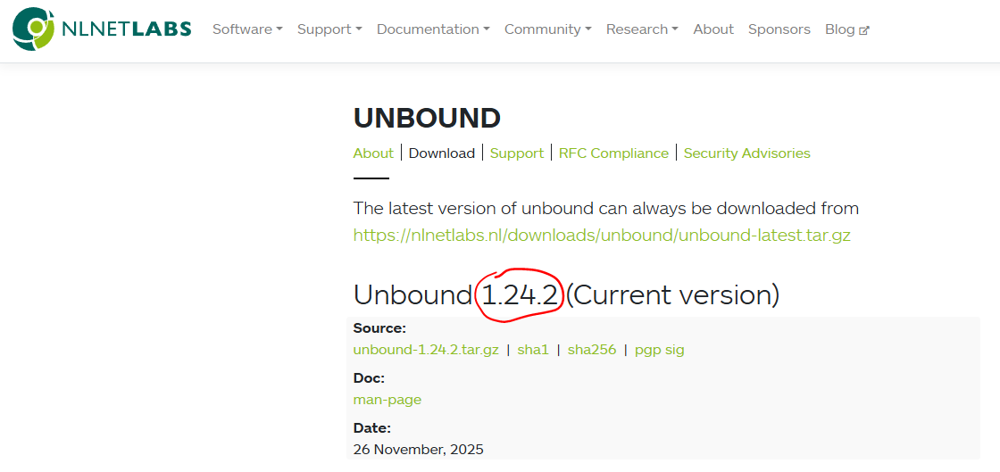
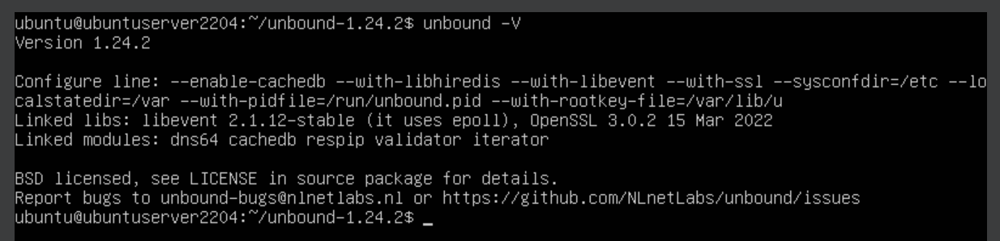
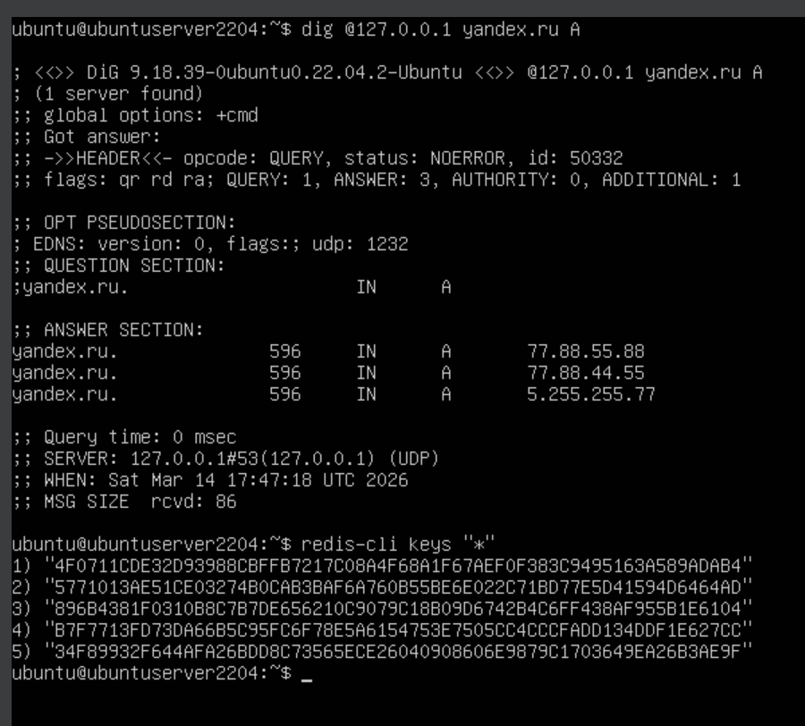

# 1.2А. Подключение внешнего кэша Redis к Unbound

Задача: пересобрать Unbound с поддержкой модуля `cachedb`, установить Redis и подключить его к Unbound в качестве внешнего персистентного кэша.

## Теория

Стандартный пакет Unbound в Ubuntu 22.04 собран без модуля `cachedb`. Чтобы подключить Redis, необходимо собрать Unbound из исходников с флагами `--enable-cachedb --with-libhiredis`.

Схема работы после подключения:

```
Клиент → Unbound (in-memory кэш) → Redis (внешний кэш) → авторитетный сервер
```

При поступлении запроса Unbound сначала проверяет собственный in-memory кэш. Если записи нет — обращается к Redis. Если нет и в Redis — уходит за ответом к авторитетному серверу, после чего сохраняет результат в оба кэша.

В отличие от in-memory кэша, Redis хранит данные на диске (`dump.rdb`) — записи переживают перезапуск Unbound.

## Шаг 1. Установка Redis

```bash
sudo apt update
sudo apt install redis-server
```

Проверяем, что Redis запущен:

```bash
sudo systemctl status redis-server
```

<div align="center">
  
</div>

## Шаг 2. Установка зависимостей для сборки Unbound

```bash
sudo apt install build-essential pkg-config libssl-dev libevent-dev libhiredis-dev libexpat1-dev libsystemd-dev
```

Эта куча зависимостей нам понадобится для сборки Unbound, который поддерживает Redis.

## Шаг 3. Сборка Unbound из исходников

Скачиваем актуальные исходники с официального сайта

> Актуальную версию можно узнать на странице загрузки [nlnetlabs.nl/projects/unbound/download](https://nlnetlabs.nl/projects/unbound/download/)
<div align="center">
  
</div>

```bash
VERSION=1.24.2
wget https://nlnetlabs.nl/downloads/unbound/unbound-${VERSION}.tar.gz
tar -xzf unbound-${VERSION}.tar.gz
cd unbound-${VERSION}
```

Конфигурируем с поддержкой `cachedb` и Redis:

```bash
./configure \
    --prefix=/usr \
    --enable-cachedb \
    --enable-systemd \
    --with-libhiredis \
    --with-libevent \
    --with-ssl \
    --sysconfdir=/etc \
    --localstatedir=/var \
    --with-pidfile=/run/unbound.pid \
    --with-rootkey-file=/var/lib/unbound/root.key
```

Собираем и устанавливаем

```bash
make
sudo make install
```

Проверяем, что модуль появился:

```bash
unbound -V
```

<div align="center">
  
</div>

В строке `Linked modules` теперь должен быть `cachedb`:

```
Linked modules: dns64 cachedb respip validator iterator
```


## Шаг 4. Настройка Unbound

```bash
sudo nano /etc/unbound/unbound.conf
```

Изменяем порядок модулей и добавляем секцию `cachedb:`:

```
server:
    chroot: ""
    module-config: "validator cachedb iterator"

remote-control:
    control-enable: yes

cachedb:
    backend: "redis"
    redis-server-host: 127.0.0.1
    redis-server-port: 6379
    redis-expire-records: no
```

> **`chroot: ""`** — явно отключает chroot-изоляцию. Без этой строки Unbound ищет все файлы конфигурации (в том числе `root.key`) внутри chroot-директории, скомпилированной в бинарник по умолчанию. Это приводит к ошибке `does not exist in chrootdir` при проверке конфига. Явное указание пустого значения гарантирует корректную работу независимо от того, с каким дефолтом собран бинарник.

> **`remote-control: control-enable: yes`** — разрешает управление Unbound через `unbound-control`. При сборке из исходников эта секция по умолчанию отсутствует в конфиге, из-за чего `unbound-control` завершается ошибкой `Connection refused`. Без этого флага команды `flush`, `dump_cache` и `flush_zone` работать не будут.

> **`module-config`:** `cachedb` должен стоять между `validator` и `iterator`. Порядок модулей имеет значение.

Проверяем синтаксис и перезапускаем:

```bash
sudo unbound-checkconf
sudo systemctl restart unbound
```

## Шаг 5. Проверка подключения

Делаем запрос через Unbound:

```bash
dig @127.0.0.1 yandex.ru A
```

Проверяем, что ключи появились в Redis:

```bash
redis-cli keys "*"
```

Если список не пустой — Unbound успешно пишет в Redis.

<div align="center">
  
</div>
