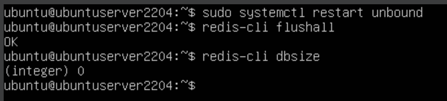
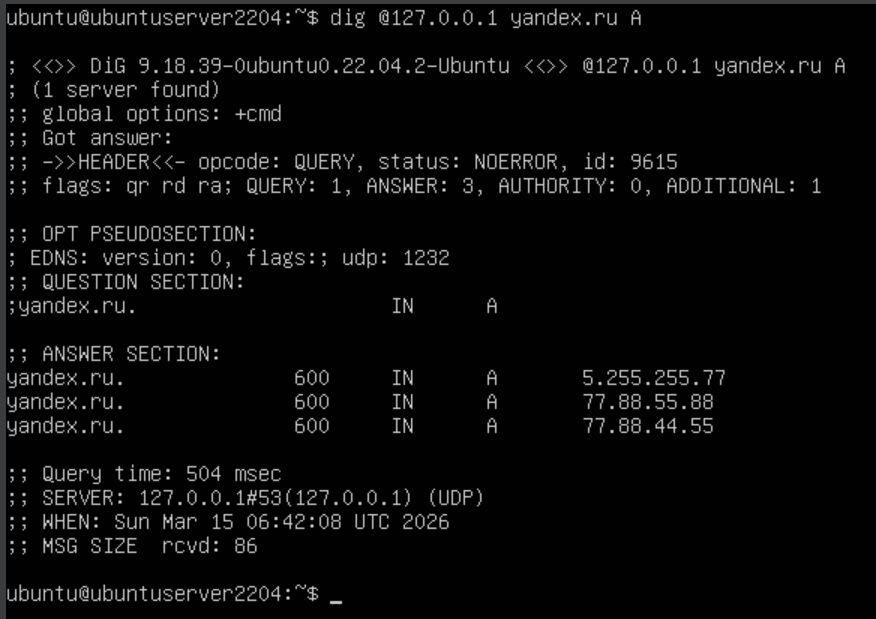
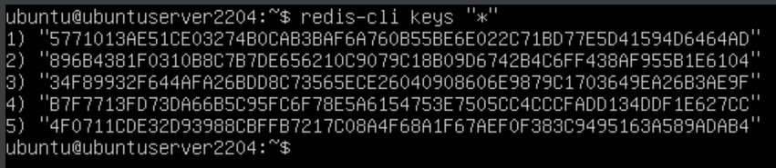
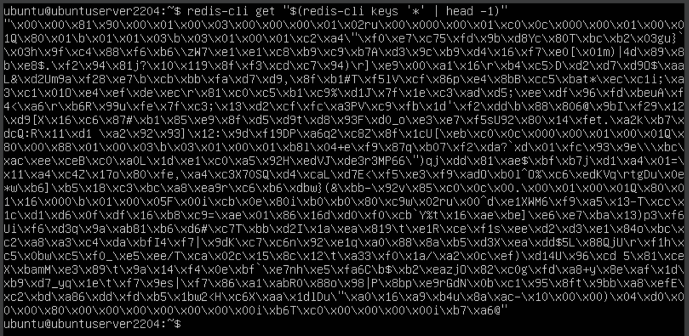

# 1.2Б. Проверка механизма кэширования с Redis

Задача: убедиться, что Unbound действительно записывает DNS-ответы в Redis после выполнения запроса.

## Шаг 1. Очистка кэша перед проверкой

Сбрасываем in-memory кэш Unbound и кэш Redis, чтобы начать с чистого состояния:

```bash
sudo systemctl restart unbound
redis-cli flushall
```

Проверяем, что Redis пуст:

```bash
redis-cli dbsize
```

Вывод должен быть `0`.

<div align="center">
  
</div>

## Шаг 2. DNS-запрос через Unbound

```bash
dig @127.0.0.1 yandex.ru A
```

<div align="center">
  
</div>

## Шаг 3. Проверка ключей в Redis

```bash
redis-cli keys "*"
```

Список не пустой — Unbound записал DNS-ответ в Redis.

<div align="center">
  
</div>

## Шаг 4. Просмотр содержимого записи

```bash
redis-cli get "$(redis-cli keys '*' | head -1)"
```

Данные хранятся в бинарном формате — это сериализованный DNS-ответ. Сам факт наличия записи подтверждает, что кэширование через Redis работает.

<div align="center">
  
</div>
