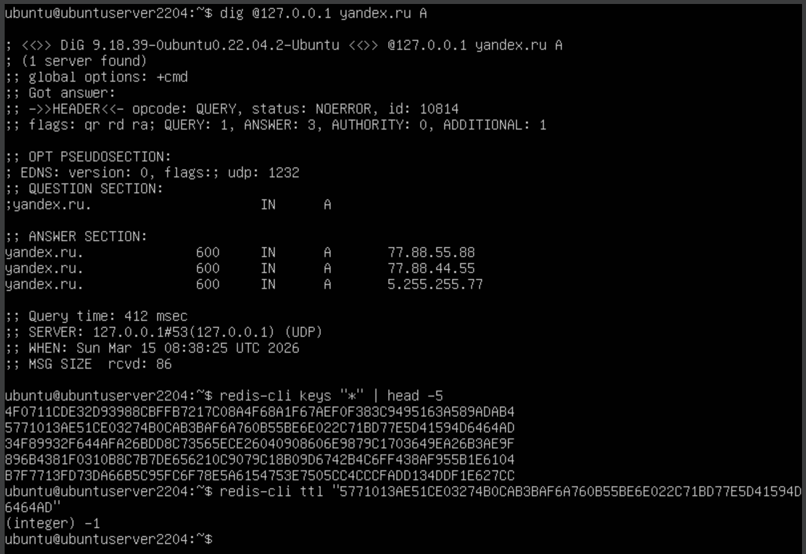
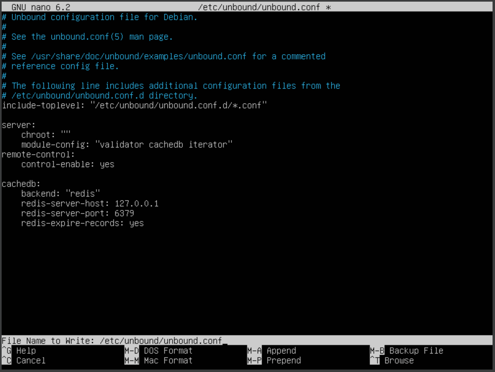
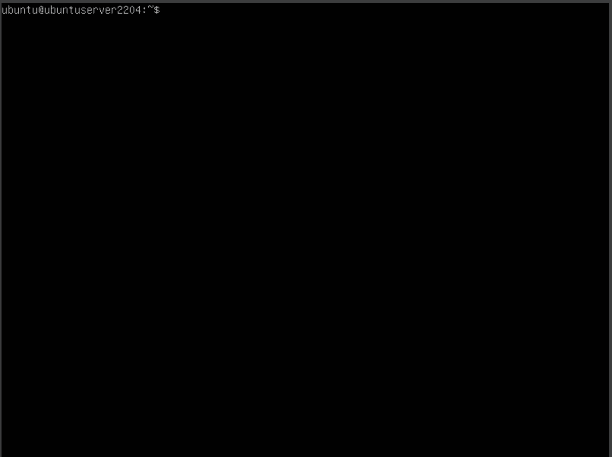

# 1.2Г. Настройка времени хранения ответов в Redis

Задача: настроить автоматическое истечение срока хранения DNS-записей в Redis в соответствии с их DNS TTL.

## Теория

По умолчанию Unbound сохраняет DNS-записи в Redis без срока действия — `redis-cli ttl <key>` возвращает `-1` («не истекает»). Это означает, что устаревшие записи накапливаются и не удаляются автоматически.

Параметр `redis-expire-records: yes` в секции `cachedb:` заставляет Unbound при записи в Redis выставлять срок жизни ключа равным оставшемуся DNS TTL. Когда DNS TTL истекает — Redis ключ удаляется автоматически.

## Шаг 1. Проверка текущего поведения

Делаем запрос и смотрим TTL ключа в Redis до изменения настроек:

```bash
dig @127.0.0.1 yandex.ru A
```

```bash
redis-cli keys "*" | head -5
redis-cli ttl "<ключ из предыдущей команды>"
```

<div align="center">
  
</div>

`TTL = -1` означает, что ключ хранится в Redis бессрочно.

## Шаг 2. Включение redis-expire-records

Открываем конфигурационный файл Unbound:

```bash
sudo nano /etc/unbound/unbound.conf
```

В секцию `cachedb:` добавляем параметр:

```
cachedb:
    backend: "redis"
    redis-server-host: 127.0.0.1
    redis-server-port: 6379
    redis-expire-records: yes
```

<div align="center">
  
</div>

## Шаг 3. Применение изменений

Очищаем Redis и перезапускаем Unbound, чтобы новые записи создавались уже с TTL:

```bash
redis-cli flushall
sudo systemctl restart unbound
```

## Шаг 4. Проверка после изменения

Делаем запрос, перезапускаем Unbound (очищаем in-memory кэш) и повторяем запрос через несколько секунд:

```bash
dig @127.0.0.1 yandex.ru A
sudo systemctl restart unbound
sleep 10
dig @127.0.0.1 yandex.ru A
```

<div align="center">
  
</div>

TTL в ANSWER-секции уменьшился примерно на 10 секунд (на изображении выше примерно на 30) — Unbound отслеживает оставшееся время и корректно его передаёт клиенту.

Убедимся, что ключи в Redis теперь имеют конечный срок жизни (не `-1`):

```bash
redis-cli keys "*" | while read key; do echo "$(redis-cli ttl "$key")s $key"; done | sort -n
```

Все ключи показывают положительный TTL — после его истечения Redis удалит их автоматически.

> **Почему TTL ключей в Redis не равен 600?**
> Redis хранит не сами DNS-записи, а внутренние объекты кэша Unbound (rrset cache, message cache). TTL ключа в Redis — это время жизни этого объекта, которое определяет сам Unbound. DNS TTL (600 с) хранится внутри бинарного значения ключа. При каждом ответе Unbound вычисляет оставшееся время: `original_ttl − (now − cached_at)` — поэтому клиент видит убывающий TTL, хотя ключ в Redis живёт дольше.