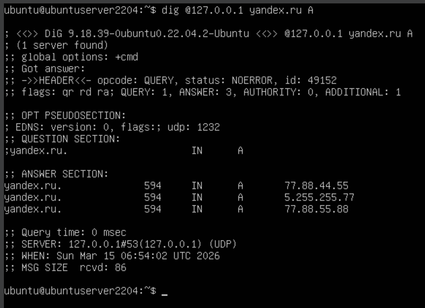
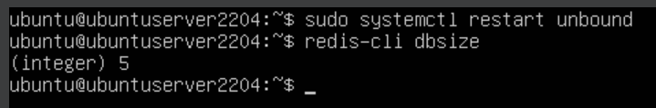
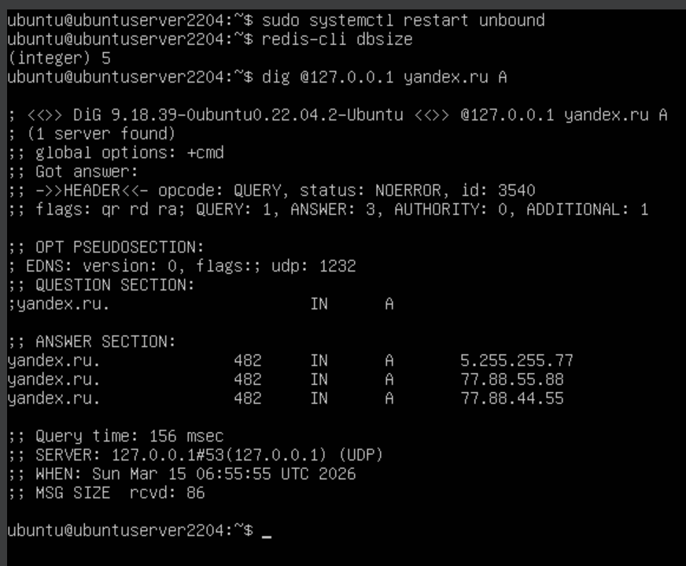

# 1.2В. Ответы DNS-резолвера из внешней БД

Задача: убедиться, что после перезапуска Unbound DNS-ответы отдаются из Redis, а не запрашиваются заново у авторитетного сервера.

## Теория

После перезапуска Unbound его in-memory кэш полностью очищается. Однако Redis хранит данные независимо от Unbound. При следующем запросе Unbound обращается к Redis и получает сохранённый ответ — TTL продолжает убывать с того момента, где остановился, а не сбрасывается до исходного значения. Это и является доказательством того, что ответ пришёл из Redis, а не от авторитетного сервера.

## Шаг 1. Начальный запрос и фиксация TTL

Убеждаемся, что Redis содержит записи от предыдущего шага (1.2Б). Делаем запрос и фиксируем значение TTL в ответе:

```bash
dig @127.0.0.1 yandex.ru A
```

<div align="center">
  
</div>

Запоминаем значение TTL в секции `ANSWER`.

## Шаг 2. Перезапуск Unbound

Перезапускаем Unbound — его in-memory кэш при этом очищается:

```bash
sudo systemctl restart unbound
```

Проверяем, что Redis по-прежнему содержит данные (не затронут перезапуском Unbound):

```bash
redis-cli dbsize
```

<div align="center">
  
</div>

## Шаг 3. Повторный запрос после перезапуска

```bash
dig @127.0.0.1 yandex.ru A
```

<div align="center">
  
</div>

TTL в ответе меньше исходного (600 с) и продолжает убывать с момента первого запроса — Unbound не обращался к авторитетному серверу, а получил запись из Redis.

## Шаг 4. Сравнение TTL

| Момент | TTL |
|---|---|
| Первый запрос (Шаг 1) | 594 с |
| После перезапуска (Шаг 3) | 482 с |
| Разница | 112 с |

Если бы Unbound обращался к авторитетному серверу, TTL сбросился бы до 600 с. Убывающее значение подтверждает, что ответ получен из Redis.