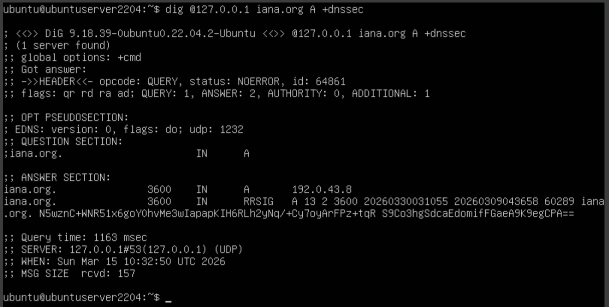
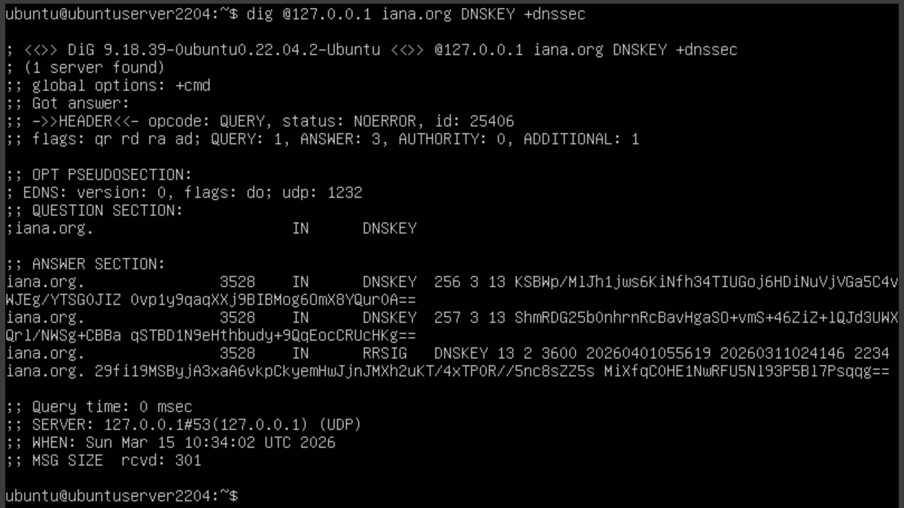
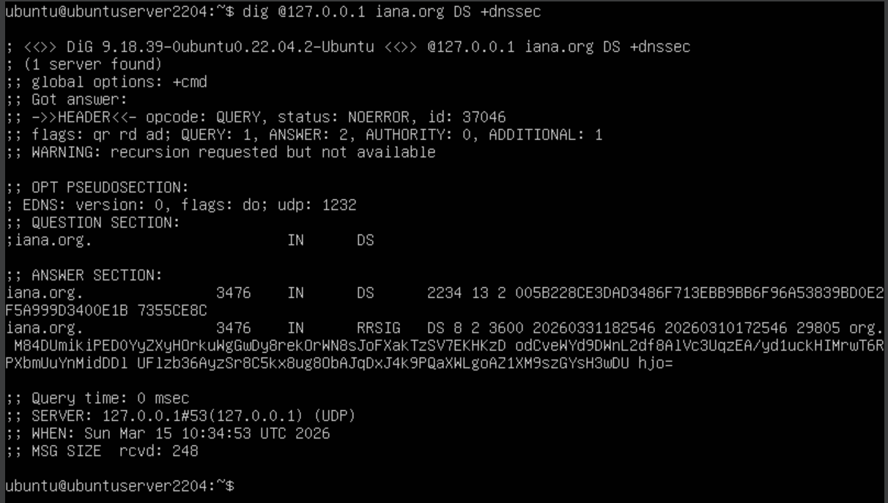
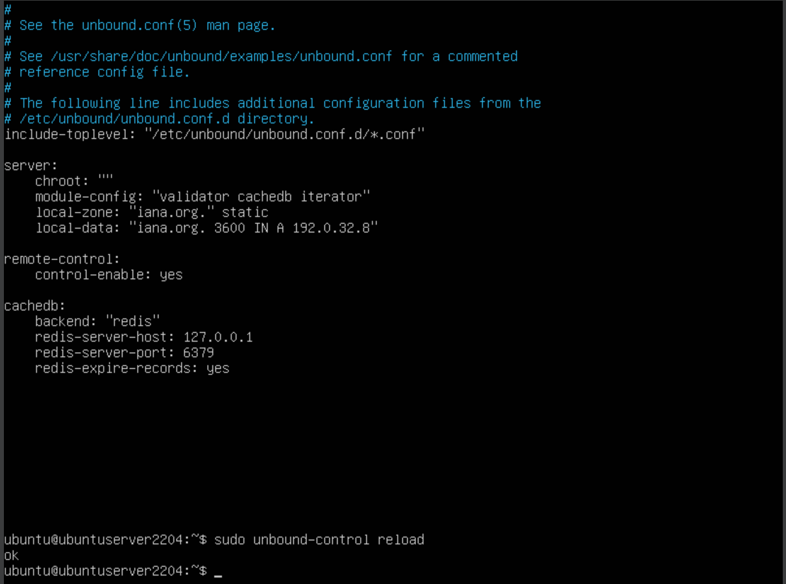

# 1.3А. Выбор зоны с DNSSEC

Задача: выбрать доменную зону с поддержкой DNSSEC и разместить её локально на резолвере.

## Теория

**DNSSEC** (DNS Security Extensions) — набор расширений протокола DNS, обеспечивающих криптографическую подпись записей. Резолвер может проверить, что ответ пришёл от легитимного авторитетного сервера и не был подменён.

Ключевые типы записей DNSSEC:

| Запись | Назначение |
|---|---|
| `RRSIG` | Цифровая подпись набора DNS-записей |
| `DNSKEY` | Открытый ключ зоны |
| `DS` | Хэш ключа дочерней зоны (связывает цепочку доверия) |
| `NSEC` / `NSEC3` | Доказательство отсутствия записи |

Цепочка доверия строится от корневой зоны (`.`) через TLD (`.org`) до целевой зоны (`iana.org`). Unbound с параметром `module-config: "validator cachedb iterator"` проверяет эту цепочку для каждого ответа.

Если DNSSEC-подпись не проходит проверку — Unbound возвращает `SERVFAIL` вместо реального ответа.

## Шаг 1. Проверка DNSSEC-подписей у iana.org

`iana.org` — домен управляющего органа интернета, подписан DNSSEC. Запрашиваем A-записи с флагом `+dnssec`:

```bash
dig @127.0.0.1 iana.org A +dnssec
```

<div align="center">
  
</div>

В секции `ANSWER` вместе с `A`-записью присутствует `RRSIG` — цифровая подпись набора. Флаг `ad` (Authenticated Data) в заголовке ответа подтверждает, что Unbound успешно верифицировал цепочку доверия.

## Шаг 2. Просмотр ключей зоны

Запрашиваем `DNSKEY`-записи зоны:

```bash
dig @127.0.0.1 iana.org DNSKEY +dnssec
```

<div align="center">
  
</div>

Вывод содержит два типа ключей: `256` (ZSK — Zone Signing Key, подписывает записи зоны) и `257` (KSK — Key Signing Key, подписывает ZSK и входит в цепочку доверия через DS-запись родительской зоны).

## Шаг 3. Проверка цепочки доверия через DS

DS-запись хранится в родительской зоне (`.org`). Проверяем её наличие:

```bash
dig @127.0.0.1 iana.org DS +dnssec
```

<div align="center">
  
</div>

DS-запись возвращается вместе с `RRSIG`, подписанной ключом зоны `.org`. Это подтверждает, что `iana.org` встроена в глобальную цепочку доверия DNSSEC.

## Шаг 4. Размещение зоны локально на резолвере

Открываем конфиг Unbound:

```bash
sudo nano /etc/unbound/unbound.conf
```

Добавляем в секцию `server`:

```
    local-zone: "iana.org." static
    local-data: "iana.org. 3600 IN A 192.0.32.8"
```

Применяем конфиг:

```bash
sudo unbound-control reload
```

На скриншоте — конфиг с добавленными строками и успешный вывод `reload`:

<div align="center">
  
</div>

Тип `static` означает: отвечать только из локальных данных, на все остальные записи зоны возвращать `NXDOMAIN`. Зона `iana.org` выбрана как эталонный пример: она подписана DNSSEC, её подпись корректна, и IP-адрес хорошо известен (`192.0.32.8`).
