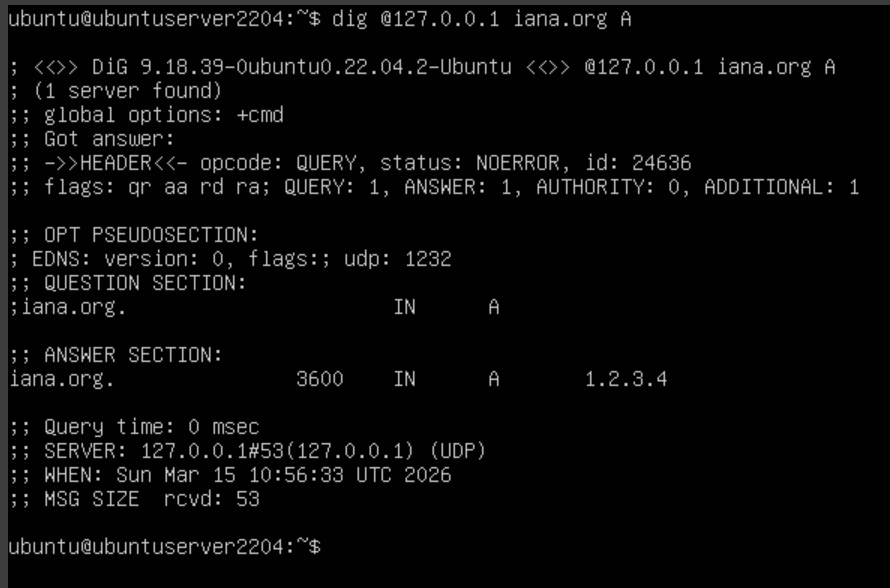
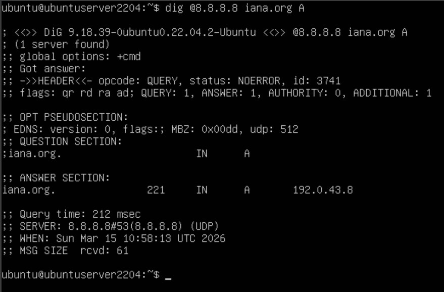

# 1.3Б. Ответы из локальной зоны

Задача: настроить резолвер на ответы по зоне `iana.org` из локальной базы, а не с авторитетных серверов.

## Теория

В Unbound порядок обработки запроса:

```
local-zone → кэш → iterator → validator
```

`local-zone: static` перехватывает запрос до того, как он доходит до валидатора DNSSEC. Поэтому ответ из локальной зоны возвращается напрямую — без проверки подписи и без `SERVFAIL`.

Чтобы однозначно доказать, что ответ идёт из локальной зоны, а не с авторитетных серверов, используем заведомо фиктивный IP-адрес в `local-data`.

## Шаг 1. Замена IP на фиктивный

Открываем конфиг и меняем `local-data`:

```bash
sudo nano /etc/unbound/unbound.conf
```

```
    local-zone: "iana.org." static
    local-data: "iana.org. 3600 IN A 1.2.3.4"
```

Применяем:

```bash
sudo unbound-control reload
```

## Шаг 2. Запрос через наш резолвер

```bash
dig @127.0.0.1 iana.org A
```

<div align="center">
  
</div>

Ответ содержит `1.2.3.4` — фиктивный адрес из локальной зоны.

## Шаг 3. Запрос к внешнему резолверу для сравнения

```bash
dig @8.8.8.8 iana.org A
```

<div align="center">
  
</div>

Внешний резолвер возвращает реальный IP (`192.0.32.8`) с флагом `ad` и записью `RRSIG` — ответ получен от авторитетных серверов с проверкой DNSSEC.

## Шаг 4. Сравнение ответов

| Признак | Наш резолвер (127.0.0.1) | Внешний (8.8.8.8) |
|---|---|---|
| IP-адрес | `1.2.3.4` (локальный) | `192.0.32.8` (реальный) |
| Флаг `ad` | Отсутствует | Присутствует |
| Запись `RRSIG` | Отсутствует | Присутствует |
| TTL | Фиксированный (3600) | Убывает |
| Query time | 0 ms | > 0 ms |

Наш резолвер отвечает из локальной базы и не обращается к авторитетным серверам `iana.org`.
