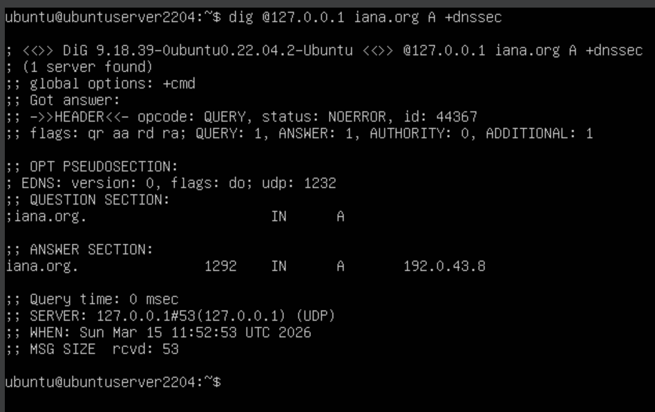
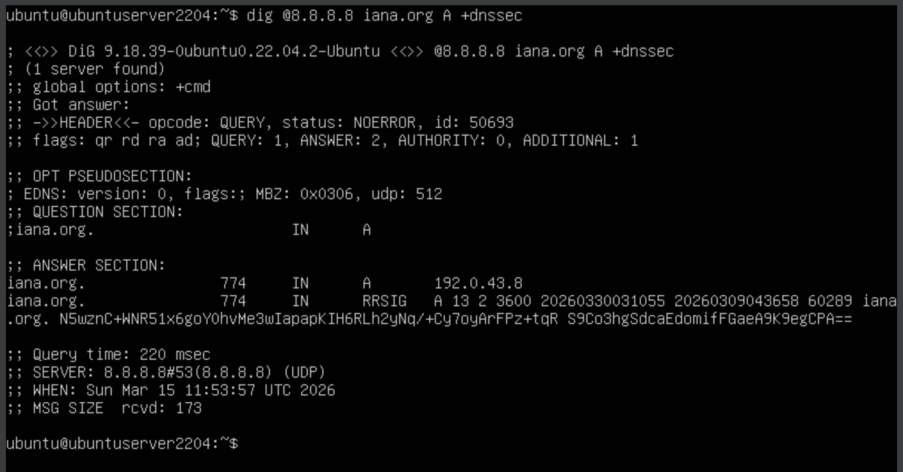
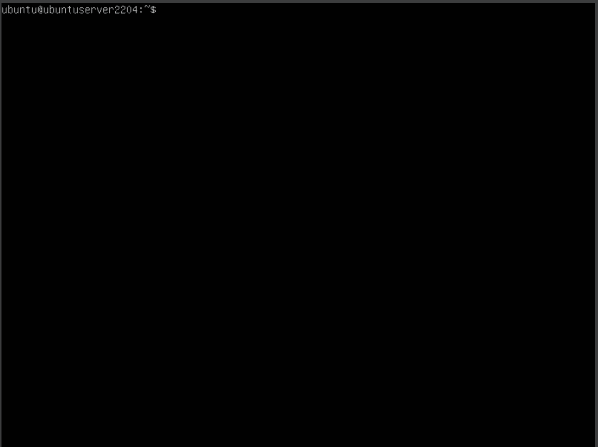

# 1.3Г. Демонстрация ответов из локальной базы

Задача: доказать, что резолвер отвечает из локальной зоны, а не обращается к авторитетным серверам `iana.org`.

## Теория

Когда Unbound получает запрос по домену, для которого настроена `local-zone: static`, он отвечает немедленно из локальной базы — не отправляя ни одного пакета в интернет. Это можно доказать тремя способами:

1. **Отсутствие DNSSEC-подтверждения** — локальные данные не подписаны, поэтому в ответе нет флага `ad` и записей RRSIG.
2. **Нулевое время ответа** — локальный ответ возвращается за 0 мс, сетевой занимает десятки миллисекунд.
3. **Трассировка** — `dig +trace` показывает полный рекурсивный путь от корня до авторитетных серверов, который наш резолвер не проходит.

## Шаг 1. Запрос к нашему резолверу

Запрашиваем `iana.org A` с флагом `+dnssec` чтобы увидеть DNSSEC-статус:

```bash
dig @127.0.0.1 iana.org A +dnssec
```

В ответе:
- нет флага `ad` — данные не аутентифицированы через DNSSEC
- нет записей `RRSIG` в секции ANSWER — данные не подписаны
- `Query time: 0 msec` — ответ пришёл из локальной базы мгновенно

<div align="center">
  
</div>

## Шаг 2. Запрос к внешнему резолверу

Тот же запрос через Google Public DNS для сравнения:

```bash
dig @8.8.8.8 iana.org A +dnssec
```

В ответе:
- флаг `ad` присутствует — DNSSEC-цепочка проверена
- записи `RRSIG` присутствуют — данные подписаны ZSK зоны `iana.org`
- `Query time` — десятки миллисекунд (сетевой запрос)

<div align="center">
  
</div>

Разница в наличии `ad` и `RRSIG` доказывает: наш резолвер отдаёт локальные данные, внешний — проверенные данные с авторитетных серверов.

## Шаг 3. Трассировка рекурсивного поиска

`dig +trace` выполняет рекурсивный поиск самостоятельно, минуя наш резолвер — начиная с корневых серверов:

```bash
dig +trace @8.8.8.8 iana.org A
```

Трассировка показывает полный путь:
```
.           → корневые серверы
org.        → TLD-серверы .org
iana.org.   → авторитетные серверы (ns.icann.org, a.iana-servers.net, ...)
```

<div align="center">
  
</div>

Это именно тот путь, который Unbound должен был бы пройти при обычном запросе — но не проходит, так как `local-zone: "iana.org." static` перехватывает запрос до обращения к сети.

## Итог

| | Наш резолвер (127.0.0.1) | Внешний (8.8.8.8) |
|---|---|---|
| Флаг `ad` | нет | есть |
| Записи `RRSIG` | нет | есть |
| Query time | 0 мс | >0 мс |
| Источник данных | локальная зона | авторитетные серверы |
