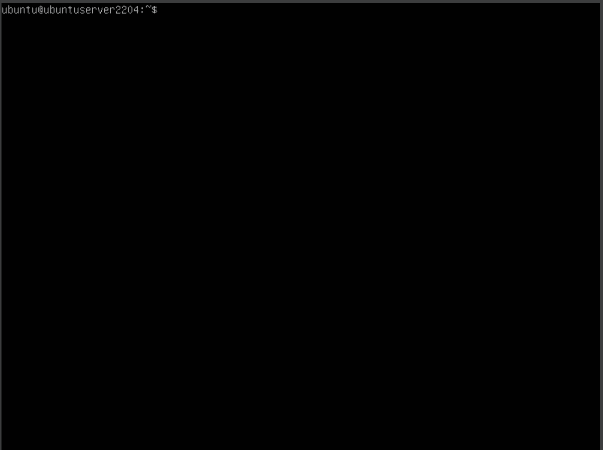
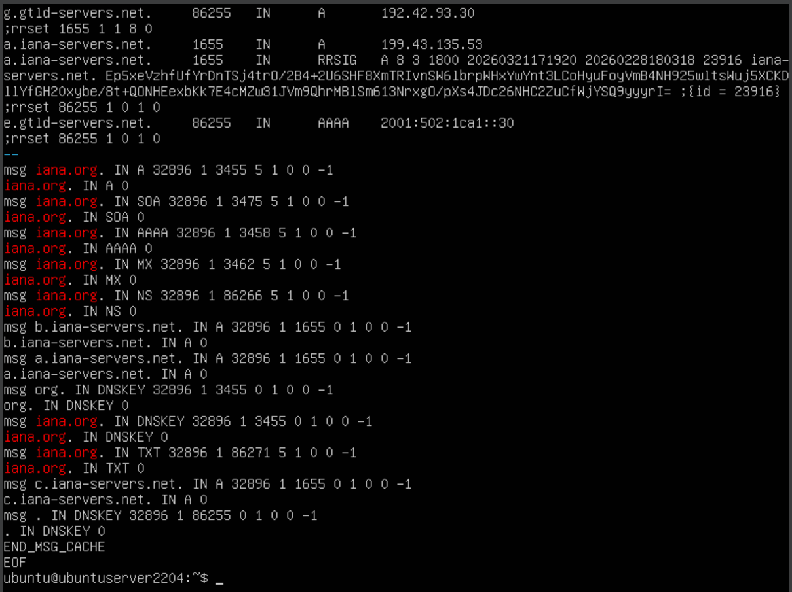
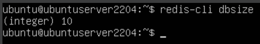
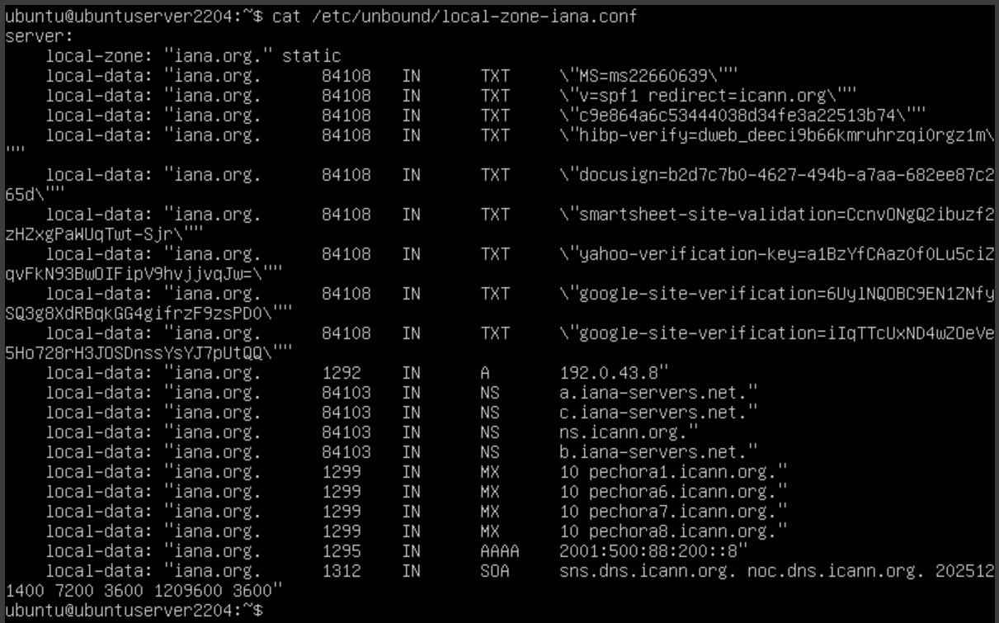

# 1.3В. Сбор данных зоны и создание локального описания

Задача: организовать сбор данных зоны `iana.org`, закэшировать ответы в Unbound и Redis, и на основе кэша создать локальное описание зоны.

## Теория

Чтобы собрать данные зоны через резолвер, нужно временно отключить `local-zone` — иначе Unbound будет отвечать из локальной базы и не пойдёт к авторитетным серверам. После сбора данных и их кэширования восстанавливаем `local-zone` с реальными значениями.

## Шаг 1. Временное отключение локальной зоны

Открываем конфиг и комментируем `local-zone` и все `local-data`:

```bash
sudo nano /etc/unbound/unbound.conf
```

```
    # local-zone: "iana.org." static
    # local-data: "iana.org. 3600 IN A 1.2.3.4"
```

Применяем:

```bash
sudo unbound-control reload
```

## Шаг 2. Сбор данных — запросы всех типов записей

Запрашиваем все основные типы через наш резолвер. Unbound резолвит их у авторитетных серверов и кэширует — в памяти и в Redis:

```bash
dig @127.0.0.1 iana.org A
dig @127.0.0.1 iana.org AAAA
dig @127.0.0.1 iana.org MX
dig @127.0.0.1 iana.org NS
dig @127.0.0.1 iana.org TXT
dig @127.0.0.1 iana.org SOA
```

<div align="center">
  
</div>

## Шаг 3. Просмотр закэшированных данных

Смотрим, что Unbound сохранил в кэше:

```bash
sudo unbound-control dump_cache | grep -A 20 "iana.org"
```

<div align="center">
  
</div>

Проверяем, что данные попали в Redis. Ключи хранятся во внутреннем бинарном формате Unbound — имя домена в них не читается, поэтому ищем по количеству ключей:

```bash
redis-cli dbsize
```

<div align="center">
  
</div>

## Шаг 4. Создание файла локальной зоны из кэша

Unbound поддерживает директиву `include:` — можно вынести локальную зону в отдельный файл. Скрипт берёт данные из кэша (`dump_cache`) и сразу создаёт готовый файл конфигурации:

```bash
ZONE="iana.org"
CONF="/etc/unbound/local-zone-iana.conf"

{
  echo "server:"
  echo "    local-zone: \"${ZONE}.\" static"
  sudo unbound-control dump_cache \
    | grep "^${ZONE}\." \
    | grep -vE "\s(DNSKEY|RRSIG|NSEC3?|DS)\s" \
    | awk 'NF>=5 {gsub(/"/, "\\\""); print "    local-data: \"" $0 "\""}'
} | sudo tee "$CONF"
```

Файл создан. Смотрим что получилось:

```bash
cat /etc/unbound/local-zone-iana.conf
```

<div align="center">
  
</div>

> TTL в `dump_cache` — остаточный (убывает с момента кэширования). Это нормально: в `local-zone` TTL фиксируется на то значение, которое указано в `local-data`.

## Шаг 5. Подключение файла и применение конфига

Добавляем `include:` в основной конфиг (один раз). Убираем старые `local-zone` и `local-data` если были:

```bash
sudo nano /etc/unbound/unbound.conf
```

```
include: "/etc/unbound/local-zone-iana.conf"
```

Проверяем и перезагружаем:

```bash
sudo unbound-checkconf
sudo unbound-control reload
```
